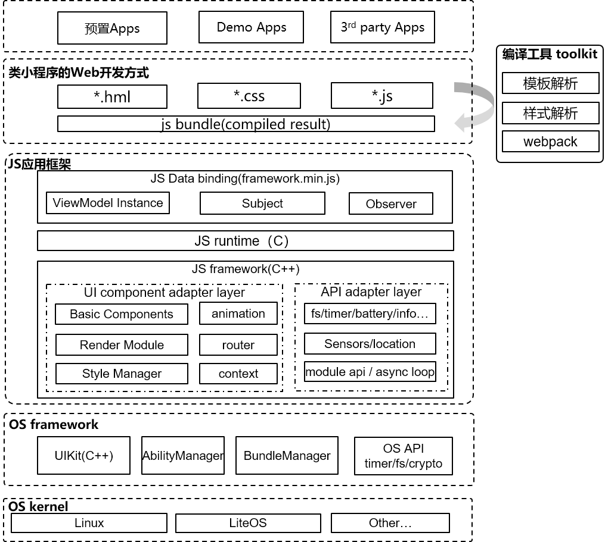

# JS-UI框架子系统组件<a name="ZH-CN_TOPIC_0000001125689015"></a>

-   [简介](#section11660541593)
-   [目录](#section1464106163817)
-   [接口](#section1096322014288)
-   [使用](#section11683166113011)
-   [相关仓](#section11683135113011)

## 简介<a name="section11660541593"></a>

轻量系统**JS-UI框架子系统**，是OpenHarmony为开发者提供的一套开发OpenHarmony应用的JS-UI框架，部署在轻量系统上，为应用提供UI开发能力。其组成如下所示：

**图 1**  JS-UI框架子系统<a name="fig11520531310"></a>


JS-UI框架子系统包括JS数据绑定框架（JS Data binding）、JS运行时（JS runtime）和JS框架（JS framework）。

-   **JS Data binding**

    JS数据绑定框架使用JavaScript语言提供一套基础的数据绑定能力。


-   **JS runtime**

    JS运行时用以支持JS代码的解析和执行。


-   **JS framework**

    JS框架部分使用C++语言提供JS API和组件的框架机制。


## 目录<a name="section1464106163817"></a>

JS-UI框架子系统源代码在/foundation/arkui/arkui\_ace\_engine\_lite下，目录结构如下图所示：

```
/foundation/arkui/arkui_ace_engine_lite
├── frameworks         # 框架代码目录
│   ├── common         # 公共工具类目录
│   ├── examples       # 示例代码目录
│   ├── include        # 头文件目录
│   ├── module_manager # JS模块管理类目录
│   ├── native_engine  # JS引擎适配层目录
│   ├── packages       # 框架JS实现存放目录
│   ├── src            # 源代码存放目录
│   ├── targets        # 各目标设备配置文件存放目录
│   └── tools          # 工具代码存放目录
├── interfaces         # 对外接口存放目录
│   └── innerkits      # 对内部子系统暴露的头文件存放目录
│       └── builtin    # JS-UI框架子系统对外暴露JS三方module API接口存放目录
└── test               # 测试用例目录
```

## 接口<a name="section1096322014288"></a>

API介绍请参考[《OpenHarmony Device开发API参考》](https://device.harmonyos.com/cn/docs/develop/apiref/js-framework-file-0000000000611396)，其中涵盖应用开发的一些基本信息，包括应用的构成以及所支持的JS-UI组件和接口说明。


## 使用<a name="section11683166113011"></a>

- 为轻量系统开发三方应用

  可参考[《轻量系统设备视觉应用开发》](https://docs.openharmony.cn/pages/v3.1/zh-cn/device-dev/guide/device-camera-visual-overview.md/)指南了解应用的开发细节。

- 调试轻量JS-UI开发框架

  为了方便地调试框架本身，提供了PC上的模拟调测工程，基于QT搭建，请参考[《框架调试模拟器使用说明》](https://gitee.com/openharmony/arkui_ace_engine_lite/blob/master/frameworks/tools/qt/simulator/README_zh.md)。


## 相关仓<a name="section11683135113011"></a>

**arkui_ace_engine_lite**

